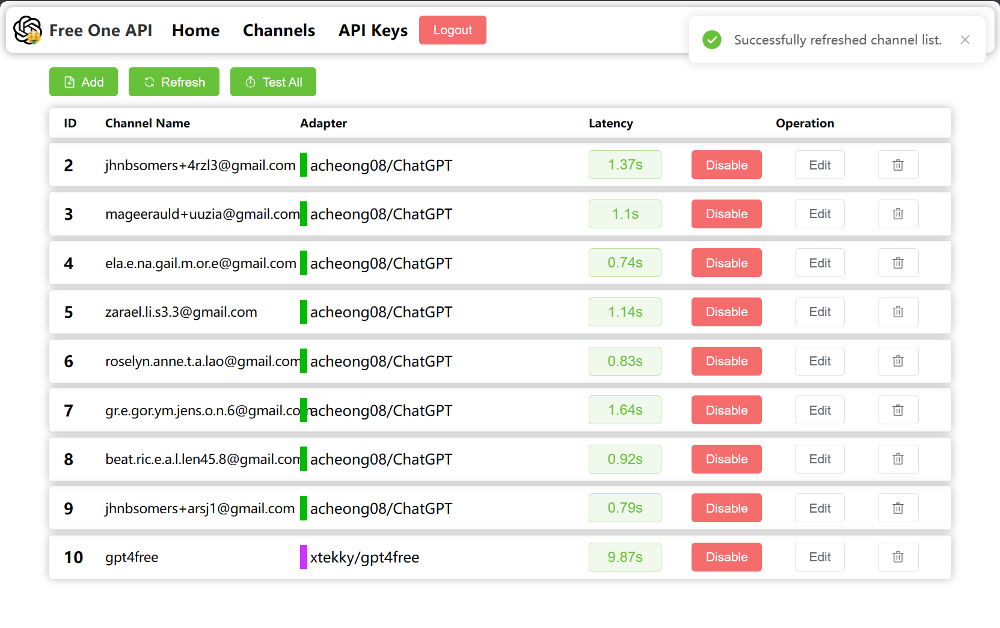
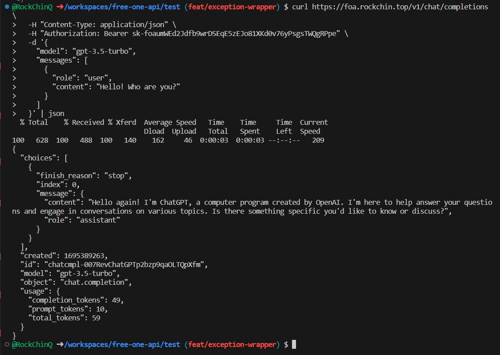

[中文](README.md) | [English](README_en.md)

<div align="center">


# free-one-api

通过标准的 OpenAI API 格式访问所有的 LLM 逆向工程库


[](https://github.com/RockChinQ/free-one-api/releases/latest)
<a href="https://hub.docker.com/repository/docker/rockchin/free-one-api">
    
  </a>


</div>

## 功能点

- 支持自动负载均衡。
- 支持 Web UI。
- 支持流模式。
- 支持多个 LLM 逆向库。

<details>
<summary>截图展示</summary>

**渠道页面:**



**添加渠道:**


**Curl:**



</details>

### 支持的 LLM 库

|Adapter|Multi Round|Stream|Function Call|Status|Comment|
|---|---|---|---|---|---|
|[acheong08/ChatGPT](https://github.com/acheong08/ChatGPT)|✅|✅|❌|✅|ChatGPT 网页版|
|[KoushikNavuluri/Claude-API](https://github.com/KoushikNavuluri/Claude-API)|✅|❌|❌|✅|Claude 网页版|
|[dsdanielpark/Bard-API](https://github.com/dsdanielpark/Bard-API)|✅|❌|❌|✅|Google Bard 网页版|
|[xtekky/gpt4free](https://github.com/xtekky/gpt4free)|✅|✅|❌|✅|gpt4free 接入多个平台的破解|
|[Soulter/hugging-chat-api](https://github.com/Soulter/hugging-chat-api)|✅|✅|❌|✅|huggingface的对话模型|
|[xw5xr6/revTongYi](https://github.com/xw5xr6/revTongYi)|✅|✅|❌|✅|阿里云通义千问网页版|

### 支持的 API 路径

- `/v1/chat/completions`

欢迎提交 issue 或 pull request 来添加更多的 LLM 库和 API 路径支持。

## 部署

### Docker (推荐)

```bash
docker run -d -p 3000:3000 --name free-one-api -v ./data:/app/data rockchin/free-one-api
```

你可以在 `http://localhost:3000/` 打开管理页面。

### 手动

```bash
git clone https://github.com/RockChinQ/free-one-api.git
cd free-one-api

cd web && npm install && npm run build && cd ..

pip install -r requirements.txt
python main.py
```

你可以在 `http://localhost:3000/` 打开管理页面。

## 用法

1. 创建一个 channel，按照说明填写配置，然后创建一个新的 key。


2. 将 url (e.g. http://localhost:3000/v1 ) 设置为 OpenAI 的 api_base ，将生成的 key 设置为 OpenAI api key。
3. 现在你可以使用 OpenAI API 来访问逆向工程的 LLM 库了。

```curl
# curl example
curl http://localhost:3000/v1/chat/completions \
  -X POST \
  -H "Content-Type: application/json" \
  -H "Authorization: Bearer $OPENAI_API_KEY" \
  -d '{
    "model": "gpt-3.5-turbo",
    "messages": [
      {
        "role": "system",
        "content": "You are a helpful assistant."
      },
      {
        "role": "user",
        "content": "Hello!"
      }
    ],
    "stream": true
  }'
```

```python
# python example
import openai

openai.api_base = "http://localhost:3000/v1"
openai.api_key = "generated key"

response = openai.ChatCompletion.create(
    model="gpt-3.5-turbo",
    messages=[
        {
            "role": "user",
            "content": "hello, how are you?"
        }
    ],
    stream=False,
)

print(response)
```

### 配置文件

配置文件位于`data/config.yaml`

```yaml
database:
  # SQLite 数据库文件路径
  path: ./data/free_one_api.db
  type: sqlite
router:
  # 后端监听端口
  port: 3000
  # 管理页登录密码
  token: '12345678'
watchdog:
  heartbeat:
    # 自动停用渠道前的心跳失败次数
    fail_limit: 3
    # 心跳检测间隔（秒）
    interval: 1800
    # 单个渠道心跳检测超时时间（秒）
    timeout: 300
web:
  # 前端页面路径
  frontend_path: ./web/dist/
```

## 快速体验

### Demo

可以登录并修改通道和key数据，每30分钟重置(xx:00/xx:30).

地址：https://foa-demo.rockchin.top  
密码：12345678  

### 测试通道

仅可使用通道，不可登录：

api_base: https://foa.rockchin.top/v1  
api_key: sk-foaumWEd2Jdfb9wrDSEqE5zEJo81XKd0v76yPsgsTWQgRPpe  
model: gpt-3.5-turbo  
