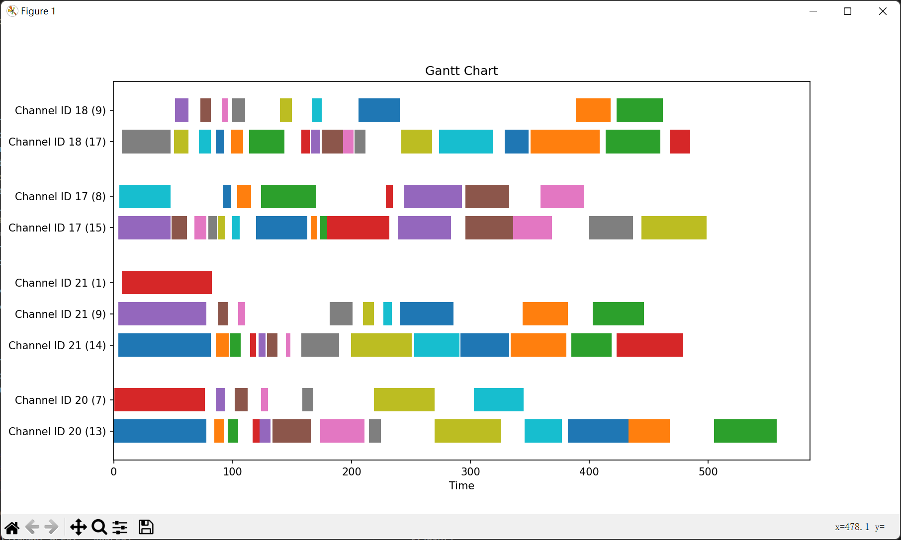

[中文文档](README.md) | [English](README_en.md)

<div align="center">


# free-one-api

Access all reverse engineered LLM libs by standard OpenAI API format.


[](https://github.com/RockChinQ/free-one-api/releases/latest)
<a href="https://hub.docker.com/repository/docker/rockchin/free-one-api">
    
  </a>


</div>

> If you want to access the **official API(paid)** of each LLM through the OpenAI standard API, you can use [songquanpeng/one-api](https://github.com/songquanpeng/one-api), `free-one-api` can also be used with the `one-api` project.

## Features

- Automatically load balance.
- Web UI.
- Stream mode supported.
- Multi lib supported.
- Heartbeat check, auto disable unavailable channel.
- Log record.

<details>
<summary>Screenshots</summary>

**Channel Page:**


**Add Channel:**


**Curl:**


</details>

### Supported LLM libs

|Adapter|Multi Round|Stream|Function Call|Status|Comment|
|---|---|---|---|---|---|
|[acheong08/ChatGPT](https://github.com/acheong08/ChatGPT)|✅|✅|❌|✅|ChatGPT Web Version|
|[KoushikNavuluri/Claude-API](https://github.com/KoushikNavuluri/Claude-API)|✅|❌|❌|✅|Claude Web Version|
|[dsdanielpark/Bard-API](https://github.com/dsdanielpark/Bard-API)|✅|❌|❌|✅|Google Bard Web Version|
|[xtekky/gpt4free](https://github.com/xtekky/gpt4free)|✅|✅|❌|✅|gpt4free cracked multiple platforms|
|[Soulter/hugging-chat-api](https://github.com/Soulter/hugging-chat-api)|✅|✅|❌|✅|hubbingface chat model|
|[xw5xr6/revTongYi](https://github.com/xw5xr6/revTongYi)|✅|✅|❌|✅|Aliyun TongYi QianWen Web Version|

### Supported API paths

- `/v1/chat/completions`

File a issue or pull request if you want to add more.

## Setup

### Docker (Recommended)

```bash
docker run -d -p 3000:3000 --restart always --name free-one-api -v ~/free-one-api/data:/app/data rockchin/free-one-api
```

This command will start free-one-api and specify `~/free-one-api/data` as the container's file storage mapping directory.  
Then you can open the admin page at `http://localhost:3000/`.

### Manual

```bash
git clone https://github.com/RockChinQ/free-one-api.git
cd free-one-api

cd web && npm install && npm run build && cd ..

pip install -r requirements.txt
python main.py
```

then you can open the admin page at `http://localhost:3000/`.

## Usage

1. Create channel on the admin page, create a new key.


2. Set the url (e.g. http://localhost:3000/v1 ) as OpenAI endpoint, and set the generated key as OpenAI api key.  
3. Then you can use the OpenAI API to access the reverse engineered LLM lib.

```curl
# curl example
curl http://localhost:3000/v1/chat/completions \
  -X POST \
  -H "Content-Type: application/json" \
  -H "Authorization: Bearer $OPENAI_API_KEY" \
  -d '{
    "model": "gpt-3.5-turbo",
    "messages": [
      {
        "role": "system",
        "content": "You are a helpful assistant."
      },
      {
        "role": "user",
        "content": "Hello!"
      }
    ],
    "stream": true
  }'
```

```python
# python example
import openai

openai.api_base = "http://localhost:3000/v1"
openai.api_key = "generated key"

response = openai.ChatCompletion.create(
    model="gpt-3.5-turbo",
    messages=[
        {
            "role": "user",
            "content": "hello, how are you?"
        }
    ],
    stream=False,
)

print(response)
```

### Configurations

Configuration file is saved at `data/config.yaml`

```yaml
database:
  # SQLite DB file path
  path: ./data/free_one_api.db
  type: sqlite
logging:
  debug: false  # Enable debug log
misc:
  # Reverse proxy address for acheong08/ChatGPT adapter.
  # Default public reverse proxy may be unstable, it is recommended to build your own:
  # https://github.com/acheong08/ChatGPT-Proxy-V4
  chatgpt_api_base: https://chatproxy.rockchin.top/api/
# Random advertisement, will be appended to the end of each response
random_ad:
  # advertisement list
  ad_list:
  - ' (This response is sponsored by Free One API. Consider star the project on GitHub:
    https://github.com/RockChinQ/free-one-api )'
  # Enable random ad
  enabled: false
  # Random ad rate
  rate: 0.05
router:
  # Backend listen port
  port: 3000
  # Admin page login password
  token: '12345678'
watchdog:
  heartbeat:
    # Max fail times
    fail_limit: 3
    # Heartbeat check interval (seconds)
    interval: 1800
    # Single channel heartbeat check timeout (seconds)
    timeout: 300
web:
  # Frontend page path
  frontend_path: ./web/dist/
```

## Quick Test

### Demo

Allow to login and modify the channel/apikey settings.Reset every 30 minutes(xx:00/xx:30).

Address: https://foa-demo.rockchin.top  
Password: 12345678

### Test channel

Can only use the channel, can't login:

api_base: https://foa.rockchin.top/v1  
api_key: sk-foaDfZxzvfrwfqkBDJEMq7C0rdXkhOjXx4aM23pH42tv8SJ4  
model: gpt-3.5-turbo  

## Performance

Gantt chart of request time with 4 channel enabled and 8 threads in client side:  
(Channel labelled with `Channel ID <id> <request count>`, X axis is time in seconds)

