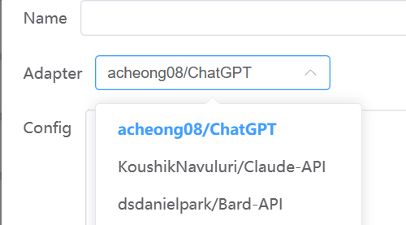

# Adapters

Free One API currently supports multiple LLM reverse engineering libraries, each channel supports a corresponding adapter, the adapter is responsible for converting the client's request into a reverse engineering library request, and converting the reverse engineering library's response into the client's response.

## acheong08/ChatGPT

ChatGPT official website reverse engineering library

### Configuration

1. Select `acheong08/ChatGPT` as `Adapter`



2. Go to `chat.openai.com` and log in to your account

3. Access `https://chat.openai.com/api/auth/session` directly in the browser, copy the `access_token` obtained


4. Enter in the `Config` column

```json
{
  "access_token": "your access token"
}
```

5. Save to test

### Reverse proxy

ChatGPT needs to use a reverse proxy to bypass Cloudflare's restrictions. The Free One API project defaults to the proxy address provided by the developer `https://chatproxy.rockchin.top/api/`, but the pressure is very high. It is strongly recommended to build a reverse proxy by yourself.

* Please configure according to this project document: <https://github.com/acheong08/ChatGPT-Proxy-V4>

Edit `misc.chatgpt_api_base` to your reverse proxy address in `data/config.yaml`.
You can also enter directly in the `Config` column when creating the `acheong08/ChatGPT` adapter

```json
{
  "reverse_proxy": "your reverse proxy address"
}
```

If not set, the `misc.chatgpt_api_base` field in the configuration file will be used as the reverse proxy address.

## KoushikNavuluri/Claude-API

Anthropic Claude official website reverse engineering library

### Configuration

1. Select `KoushikNavuluri/Claude-API` as `Adapter`

2. Log in to `claude.ai`, open `F12`, select the `Network` column, find any request, and copy the `Cookie` string in the request header


3. Enter in the `Config` column

```json
{
  "cookie": "your cookie"
}
```

## xtekky/gpt4free

xtekky/gpt4free integrates multiple LLM reverse engineering libraries of multiple platforms

### Configuration

1. Select `xtekky/gpt4free` as `Adapter`

2. No authentication required, just save

## Soulter/hugging-chat-api

huggingface.co/chat official website reverse engineering library

### Configuration

1. Register `HuggingFace` account

2. Select `Soulter/hugging-chat-api` as `Adapter`

3. Enter in the `Config` column

```json
{
  "email": "HuggingFace Email",
  "passwd": "HuggingFace Password"
}
```

## xw5xr6/revTongYi

Aliyun TongYi QianWen official website reverse engineering library

### Configuration

1. Select `xw5xr6/revTongYi` as `Adapter`

2. Go to <https://qianwen.aliyun.com/> and log in to your account

3. Refer to the configuration method of Claude above to obtain the `Cookie` string

4. Enter in the `Config` column

```json
{
  "cookie": "通义千问cookie"
}
```
