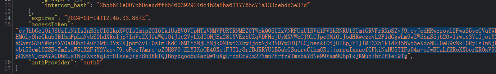
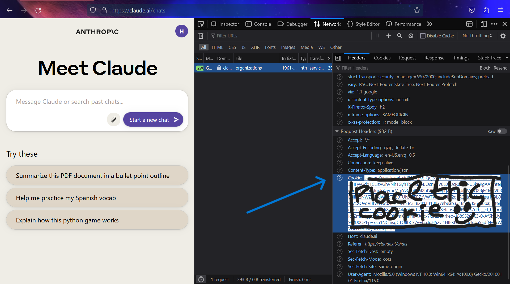

# 适配器

Free One API 目前支持多种 LLM 逆向工程库，每个渠道支持对应一个适配器，适配器负责将客户端的请求转换成逆向工程库的请求，并将逆向工程库的响应转换成客户端的响应。

## acheong08/ChatGPT

ChatGPT 官网逆向工程库

### 配置方式

1. 选择 `acheong08/ChatGPT` 作为 `Adapter`


2. 前往 `chat.openai.com` 登录账号

3. 直接在浏览器访问 `https://chat.openai.com/api/auth/session`, 复制得到的 `access_token`



4. 在 `Config` 栏中输入

```json
{
  "access_token": "你的access token"
}
```

5. 保存即可测试

## KoushikNavuluri/Claude-API

Anthropic Claude 官网逆向工程库

### 配置方式

1. 选择 `KoushikNavuluri/Claude-API` 作为 `Adapter`

2. 登录 `claude.ai`, 打开 `F12`, 选择 `Network` 栏, 找到任意一个请求, 复制请求头中的 `Cookie` 字符串



3. 在 `Config` 栏中输入

```json
{
  "cookie": "你的cookie"
}
```

## xtekky/gpt4free

xtekky/gpt4free 整合了多个平台的 LLM 逆向工程库

### 配置方式

1. 选择 `xtekky/gpt4free` 作为 `Adapter`

2. 无需鉴权，直接保存即可

## Soulter/hugging-chat-api

huggingface.co/chat 官网逆向工程库

### 配置方式

1. 注册 `HuggingFace` 账号

2. 选择 `Soulter/hugging-chat-api` 作为 `Adapter`

3. 在 `Config` 栏中输入

```json
{
  "email": "HuggingFace 注册邮箱",
  "passwd": "HuggingFace 密码"
}
```

## xw5xr6/revTongYi

阿里云通义千问官网逆向工程库

### 配置方式

1. 选择 `xw5xr6/revTongYi` 作为 `Adapter`

2. 前往 <https://qianwen.aliyun.com/> 登录账号并确保可以正常对话

3. 参照上方 Claude 的配置方式，获取 `Cookie` 字符串

4. 在 `Config` 栏中输入

```json
{
  "cookie": "通义千问cookie"
}
```

