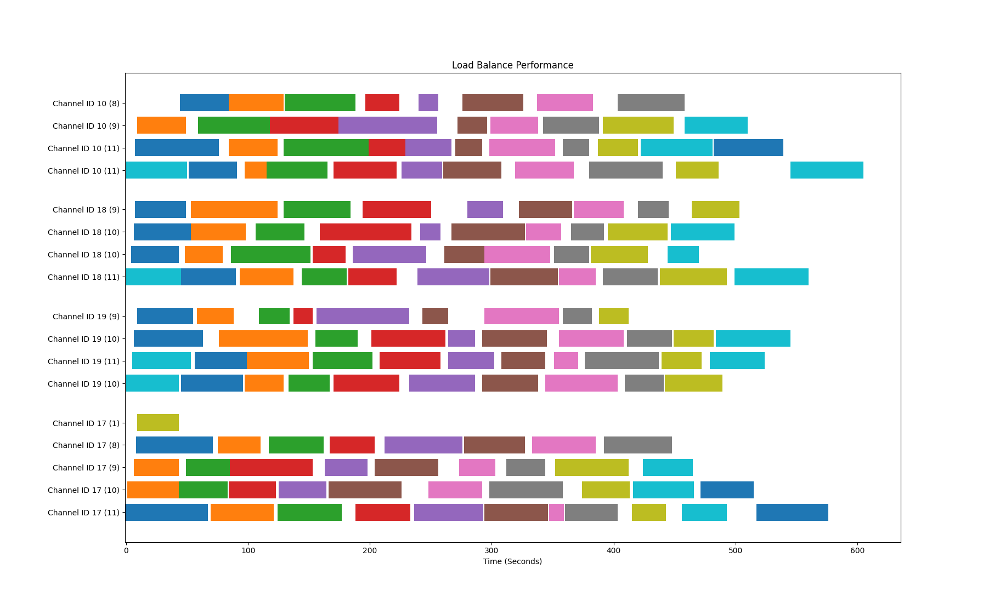

# Free One API 中文文档

## 支持的 LLM 库

|Adapter|Multi Round|Stream|Function Call|Status|Comment|
|---|---|---|---|---|---|
|[acheong08/ChatGPT](https://github.com/acheong08/ChatGPT)|✅|✅|❌|✅|ChatGPT 网页版|
|[KoushikNavuluri/Claude-API](https://github.com/KoushikNavuluri/Claude-API)|✅|❌|❌|✅|Claude 网页版|
|[dsdanielpark/Bard-API](https://github.com/dsdanielpark/Bard-API)|✅|❌|❌|✅|Google Bard 网页版|
|[xtekky/gpt4free](https://github.com/xtekky/gpt4free)|✅|✅|❌|✅|gpt4free 接入多个平台的破解|
|[Soulter/hugging-chat-api](https://github.com/Soulter/hugging-chat-api)|✅|✅|❌|✅|huggingface的对话模型|
|[xw5xr6/revTongYi](https://github.com/xw5xr6/revTongYi)|✅|✅|❌|✅|阿里云通义千问网页版|

## 支持的 API 路径

- `/v1/chat/completions`

欢迎提交 issue 或 pull request 来添加更多的 LLM 库和 API 路径支持。

## 负载均衡性能

启用4个通道，客户端16个线程的请求时间甘特图，请求提问“write a quick sort in Java”：  
(通道标记为 `Channel ID <id> <request count>`, X 轴为时间秒数, 每个色块为一次请求)

