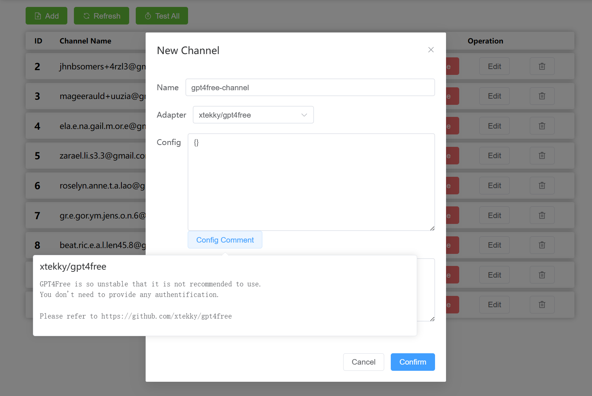

# 用法

1. 创建一个 channel，填写名称。



2. 选择此渠道使用的逆向工程库适配器，填写配置。

> 请参考[适配器](/zh-CN/Adapters.md)文档。

3. 在 API Key 栏中创建一个新的 key。

4. 将 url (e.g. http://localhost:3000/v1 ) 设置为 OpenAI 的 api_base ，将生成的 key 设置为 OpenAI api key。
5. 现在你可以使用 OpenAI API 来访问逆向工程的 LLM 库了。

## 测试

```curl
# curl example
curl http://localhost:3000/v1/chat/completions \
  -X POST \
  -H "Content-Type: application/json" \
  -H "Authorization: Bearer $OPENAI_API_KEY" \
  -d '{
    "model": "gpt-3.5-turbo",
    "messages": [
      {
        "role": "system",
        "content": "You are a helpful assistant."
      },
      {
        "role": "user",
        "content": "Hello!"
      }
    ],
    "stream": true
  }'
```

```python
# python example
import openai

openai.api_base = "http://localhost:3000/v1"
openai.api_key = "generated key"

response = openai.ChatCompletion.create(
    model="gpt-3.5-turbo",
    messages=[
        {
            "role": "user",
            "content": "hello, how are you?"
        }
    ],
    stream=False,
)

print(response)
```
